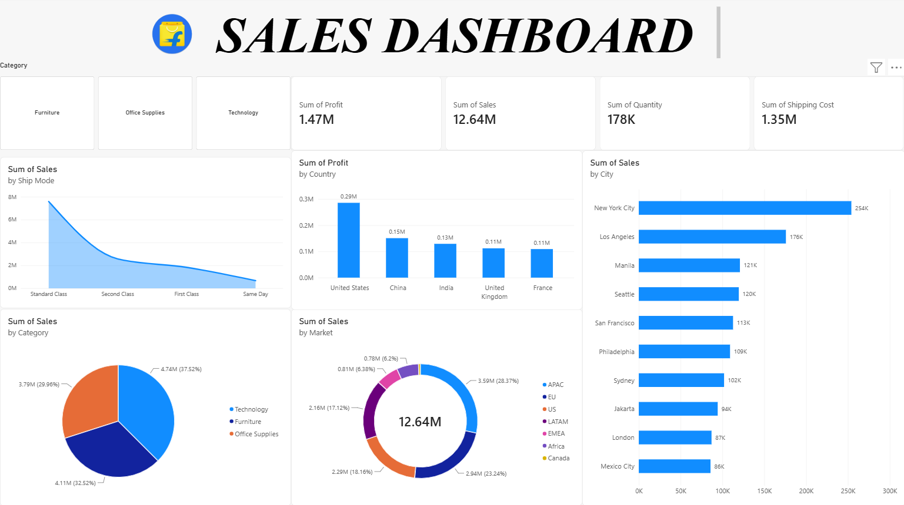

<div align="center">

# 🛒 FLIPKART SALES DASHBOARD

### `POWER BI` • `DATA ANALYTICS` • `BUSINESS INTELLIGENCE`



<br>


</div>

---

## ✦ PROJECT OVERVIEW

> **An interactive Power BI dashboard designed to transform large-scale sales data into meaningful business insights.**

This project analyzes sales performance, profitability, quantity, shipping costs, markets, categories, countries, and cities through an interactive **Business Intelligence dashboard**.

The dashboard was created to practice the complete analytics workflow — from **data preparation and transformation to visualization and business analysis**.

---

## 📊 BUSINESS SNAPSHOT

<div align="center">

| 💰 TOTAL SALES | 📈 TOTAL PROFIT | 📦 TOTAL QUANTITY | 🚚 SHIPPING COST |
|:---:|:---:|:---:|:---:|
| **$12.64M** | **$1.47M** | **178K** | **$1.35M** |

</div>

---

# 🔎 WHAT DOES THIS DASHBOARD ANALYZE?

### 💰 SALES PERFORMANCE

- Sales by Category
- Sales by Market
- Sales by City
- Overall Sales Performance

### 📈 PROFITABILITY

- Profit by Country
- Overall Profit Performance
- Country-level profitability comparison

### 📦 OPERATIONS

- Quantity Analysis
- Shipping Cost Analysis
- Ship Mode Performance

---

# 🗂️ DATASET

The dataset contains detailed order-level information covering customers, products, geography, sales, shipping, profit, and returns.

### 📋 DATASET STRUCTURE

| Sheet | Records | Purpose |
|:---|---:|:---|
| 📦 **Orders** | **51,289** | Main sales & order-level data |
| 🔄 **Returns** | **1,173** | Returned orders & market information |
| 👥 **People** | **13** | Regional people/manager information |

### 📅 DATA PERIOD

<div align="center">

### **2011 → 2014**

</div>

---

# 🧩 DATASET FEATURES

The **Orders** sheet contains information related to:

```text
Customer Information
        ↓
Product Information
        ↓
Category & Sub-Category
        ↓
Geographic Information
        ↓
Sales & Quantity
        ↓
Discount & Profit
        ↓
Shipping Cost
        ↓
Order Priority
